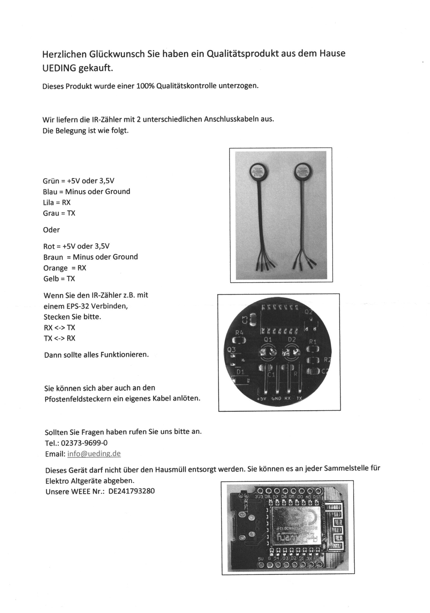
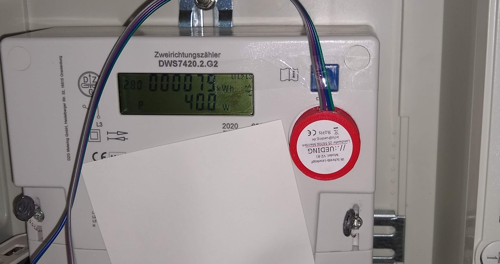

# SML Zähler mit ESPHome auslesen

In diesem Artikel beschreibe ich kurz das "Smart-machen" meines Stromzählers und stelle euch meine ESPHome-Konfiuration für einen DZG-DWS7420-Zähler
bereit.

## Hinweis

Dieser Artikel dient vor Allem der persönlichen Dokumentation und ist nicht als Anleitung zu verstehen. Nichts desto trotz möcht ich meine Erfahrungen
beim Ausfetzen des Smart-Meters teilen, zumal ich beim Suchen nicht gleich passende Informationen und Lösungen gefunden habe....

## Links

- [Anwendungshilfe OBIS-Formate (edi-energy.de)](https://www.edi-energy.de/index.php?id=38&tx_bdew_bdew%5Buid%5D=639&tx_bdew_bdew%5Baction%5D=download&tx_bdew_bdew%5Bcontroller%5D=Dokument&cHash=75fd6ffb51419603eabab58339dfd90f)
- [OBIS-Kennzahlen](https://sharepoint.infra-fuerth.de/unbundling/obis_kennzahlen.pdf)
- [Testen des IR Schreib-Lesekopf](https://wiki.volkszaehler.org/hardware/controllers/ir-schreib-lesekopf-usb-ausgang)
- [Handbuchg meines Stromzählers](https://www.stadtwerke-elmshorn.de/de/Privatkunden/Netze/Stromnetz/Stromnetz-Relaunch/Messstellenbetrieb/DZG-DWS74-Kurzanleitung.pdf)
- [Beschreibung "Smart-Meter mit Tasmota auslesen"](https://homeitems.de/smartmeter-mit-tasmota-auslesen/)
- [Hessburg "Tasmota-WiFi-Smartmeter konfigurieren"](https://hessburg.de/tasmota-wifi-smartmeter-konfigurieren/)
- [BertBlog "Smartmeter Stromzähler ESPHome und SML für Homeassistant auslesen"](https://www.mittelstedt.net/?tag=esphome)
- [Mein IR-Lesekopf](https://ueding.de/volkszaehler-ir-schreib-lesekopt-ttl)
- [NodeMCU Pinnbelegung](https://smarthome-blogger.de/blog/esp8266-projekte/nodemcu-esp8266-pinout)
- [NodeMCU/ESP32 bei eBay](https://www.ebay.de/sch/i.html?_nkw=nodemcu+esp32&_sacat=0)
- [Aktivieren der Übertragung des aktuellen Verbrauchs](https://shop.weidmann-elektronik.de/media/files_public/ef65a5f91f3dabc8252faaababd91b30/Freischaltung_D0_Schnittstelle.pdf)

## Wie kam es dazu?

In meiner Home-Assistant-Installation habe ich bereits einige ESPHome-Geräte (mehrere Steckdosen, eine RF-Bridge). Nach der Installation eines
Balkon-Kraftwerks möchte ich nun auch die Werte meines Stromzählers auslesen.

All meine anderen Geräte habe ich als Fertig-Gerät gekauft und nach Anleitung mit Tasmota bzw. ESPHome geflasht. Vor laaaanger Zeit hatte ich mal
ein wenig mit Elektronik-rumgebastelle auf einem Breadboard, mit blinkenden LEDs, Microcontrollern (darunter auch einige ESP8266 sowie einem ESP32 auf einen
NodeMCU-Board, etc) begonnen, aber dann wieder aufgehört. Das ganze Zeug flog noch in einer Kiste rum und daher kam mir die Idee den Stromzähler mal selbst zu bauen.
Anleitungen etc. sollte es ja wohl genügend geben :-)
In Sachen "Smart-Home-Harware selbst bauen" bin ich daher -ich sage es mal so- unerfahren. WiFi-Steckdosen, etc gibt es ja schon für kleines Geld und mit ein wenig
Arbeit passt das dann auch ins eigene Universum. Beim Stromzähler kam ich dann aber an Grenzen. Knappe 100€ für einen fertigen Zähler (z.B. Powerfox oder Tibber Pulse)
war mir dann doch zu viel. Bei der Suche nach weiteren Möglichkeiten ist mir dann der [Volkszähler](https://wiki.volkszaehler.org/hardware/controllers/ir-schreib-lesekopf)
unter gekommen, so dass ich beschloss es mal damit zu probieren. Da hat mich der Ergeiz gepackt und ich wollte versuchen das Gerät dann eben selbst zu bauen. Daher habe ich,
statt des fertigen Gerätes für ca. 50€, nur den IR-Schreib-Lesekopf bestellt, zumal ich ja noch ein paar Microcontroller hatte. Kostenpunkt hierfür lag bei knapp 20€.

## erste Versuche

Für die ersten Versuche habe ich die ESP8266 verwendet. Per FT232 USB-TTL-Serial Adapter geht das flashen ja ganz einfach. Der ESP8266 lief auch, solange der am
FT232 angeschlossen war. Sobald ich aber die Stromversorgung umgestellt habe und über das Breadboard versorge, fährt der ESP8266 nicht mehr hoch. Meine eigentliche Idee,
den Stromleser mit einer Batterie zu betreiben ist damit hinfällig.

# Einrichtung des Node-MCU / ESP 32

Homeassistant und ESPHome machen es einem ja sehr leicht neue Geräte zu flashen. Den NodeMCU gepackt per USB-Kabel an meine PC gesteckt, ein neues Gerät eingerichtet,
flashen, fertig; Das Gerät in einer einfachen Konfiguration ist damit ja schon mal betriebsbereit, kann zwar noch nix, aber der Rest ist ja nur ein bischen YAML aus den
passenden Quellen kopieren und fertig ist der Stromzähler.

Weit gefehlt, jetzt ging das Suchen los. Für Tasmota gibt es einige Anleitungen, irgendwann habe ich auf den [**BertBlog**](https://www.mittelstedt.net/) gestoßen.
YAML kopiert, eingefügt, fertig.
Bis auf die Tatsache, dass der IR-Lesekopf noch gar nicht angeschlossen war. Wieder ein wenig suchen,
[Pinnbelegung](https://smarthome-blogger.de/blog/esp8266-projekte/nodemcu-esp8266-pinout) des NodeMCU rausgesucht, IR-Kopf angeschlossen
(und natürlich erstmal Rx und Tx vertauscht, obwohl in der Anleitung zum des IR-Kopfes steht: *... mit  einem ESP-32 verbinden, Stecken Sie RX <-> TX / TX <-> RX* ,
aber wer ließt schon Anleitungen).



## Installation

So nun steht der Installation ja nichts mehr im Wege. Im Stromzähler habe ich dummerweise keine Steckdose, weshalb ich auf eine Powerbank zurückgreife. Kabel
angeschloßen und Lesekopf auf den Zähler gepackt. Nur wie "verlege" ich jetzt dis Sachen? Das Kabel zwischen IR-Kopf und dem NodeMCU ist so steif, dass, egel wo ich den
NodeMCU hin stecke, entweder der IR-Kopf von der Leseposition abfällt oder sich verdreht. Gut, nach einigem Hin und Her habe ich eine Position gefunden, in welcher alles
stabil ist. Zurück an den PC und -Enttäuschung- keine Daten!

Nachdem ich dann Alles mehrfach durchgespielt habe, erkenne ich die farblichen Unterschiede von IR-Sende- und Lese-Kopf. Ebenso sind die Dioden am Zähler unterschiedlich.
Den IR-Kopf "*auf den Kopf gestellt*" und schon trudeln die ersten Daten ein; ohne aktuellen Verbrauch, aber das ahnte ich ja schon, da das in den diversen Seiten schon
beschrieben wurde.



## Aktivieren der Verbrauchsmessung

Gemäß den *Vorrednern* weiß ich, dass ich den Freiscahltcode bei meinen Stadtwerken beantragen muss. Nichts einfacher als das, Mail an meine Stadtwerke. Ganze *drei
Minuten* hat es gedauert bis die Antwort per Mail kam. Das war das einzige, was Problemlos lief; Danke an meine
[Stadtwerke](https://www.stadtwerke-elmshorn.de/).

Auf zum Zähler, Code eingeben und schon wird der Aktuelle Verbrauch auch im Display des Zählers angezeigt. Super, zurück am PC schaue ich mir das OBIS-Log an. Ernüchterung;
keine weiteren Daten. Die [Kurzanleitung](https://www.stadtwerke-elmshorn.de/de/Privatkunden/Netze/Stromnetz/Stromnetz-Relaunch/Messstellenbetrieb/DZG-DWS74-Kurzanleitung.pdf)
des Stromzählers gibt leider nicht viel her. In der Kurzanleitung ist keine Beschreibung der Bedienung und der einzelnen "Menü"-Punkte enthalten.
Beim weiteren Suchen finde ich diese Kurzanleitung zu Hauf'. Irgendwann stoße ich dann aber doch auf das Dokument
["Freischaltung der D0-Schnittstelle"](https://shop.weidmann-elektronik.de/media/files_public/ef65a5f91f3dabc8252faaababd91b30/Freischaltung_D0_Schnittstelle.pdf). :-)
Zurück zum Zähler, PIN erneut eingeben, Durchklicken bis `Inf` im Display erscheint, aktivieren.

Endlich läuft alles! Die Daten werden zuerst noch etwas falsch berechnet, aber mit etwas Anpassung am YAML werden nun auch die Kommastellen korrekt berechnet!

**Smile**

## Schlußbemerkung

Für den Betrieb habe ich mir jetzt statt eines NodeMCU-Boards einen D1-Mini besorgt und statt der Powerbank ein passendes Netzteil in der Nähe des Zählers mit einem langen USB-Kabel angeschlossen.
Unten ist noch das YAML meines Entwicklungs-Boards drin, aber die Passworte und Keys
dürft ihr gerne haben!!

# Daten

## OBIS-Codes

Code | Beschreibung
---- | ----
1-0:1.8.0 | Zählerstand 1
1-0:2.8.0 | Zählerstand 2
1-0:96.50.1 | Hersteller
1-0:96.1.0 | Seriennummer
1-0:16.7.0 | aktueller Verbrauch

*Anmerkung*: die Seriennummer kann nicht direkt als `text_sensor` ausgelesen werden. Das erste Byte ist numerisch (bzw. müsste per Hex2Int umgewandelt werden), Bytes 2-4 ergeben den String "DZG" (Hex2String), der Rest ist die weitere Seriennummer (hex2Int). Das habe ich mir erspart, zumal sich die Nummer nie ändern wird und in der Heimautomatisierung keinen
wirklichen Nutzen hat.

## mein YAML-Code

```
substitutions:
  device_name: nodemcu-dev
  friendly_name: NodeMCU Development
  device_description: NodeMCU EntwicklerBoard
  ir_read: GPIO3
  ir_send: GPIO1


esphome:
  name: ${device_name}
  comment: ${device_description}
  friendly_name: ${friendly_name} 

esp8266:
  board: nodemcuv2

# Enable logging
logger:
  baud_rate: 0
  # level: INFO

# Enable Home Assistant API
api:
  encryption:
    key: "6FLd5DS8ya6zu22fz5jmh0b6mZvTKo5yyalU="

ota:
  password: "b42f6843c0409"

wifi:
  ssid: !secret wifi_ssid
  password: !secret wifi_password

  # Enable fallback hotspot (captive portal) in case wifi connection fails
  ap:
    ssid: "Nodemcu-Dev Fallback Hotspot"
    password: "Fallback-PW"

captive_portal:
    

# Enable Web server
web_server:
  port: 80
  local: true


# Text sensors with general information
text_sensor:
  - platform: version
    name: Version
  - platform: wifi_info
    ip_address:
      name: IP Address
  - platform: sml
    name: "Manufacturer"
    sml_id: mysml
    obis_code: "1-0:96.50.1"
    format: text      
  #- platform: sml
  #  name: "Zählernummer"
  #  sml_id: mysml
  #  obis_code: "1-0:96.1.1"
  #  format: text


sensor:
  # Uptime sensor
  - platform: uptime
    name: Uptime
  # WiFi Signal sensor
  - platform: wifi_signal
    name: Wifi Signal
    update_interval: 60s
  - platform: sml
    name: "Total energy"
    sml_id: mysml
    # server_id: "0123456789abcdef"
    obis_code: "1-0:1.8.0"
    unit_of_measurement: kWh
    accuracy_decimals: 0
    device_class: energy
    state_class: total_increasing
    filters:
      - multiply: 0.0001      
  - platform: sml
    name: "Total energy 2"
    sml_id: mysml
    # server_id: "0123456789abcdef"
    obis_code: "1-0:2.8.0"
    unit_of_measurement: kWh
    accuracy_decimals: 0
    device_class: energy
    state_class: total_increasing
    filters:
      - multiply: 0.0001      
  - platform: sml
    name: "Current power"
    sml_id: mysml
    # server_id: "0123456789abcdef"
    obis_code: "1-0:16.7.0"
    unit_of_measurement: W
    accuracy_decimals: 1
    device_class: energy
    state_class: total_increasing
    filters:
      - multiply: 0.01      


uart:
  id: uart_bus
  rx_pin: ${ir_read}
  baud_rate: 9600
  data_bits: 8
  parity: NONE
  stop_bits: 1
  # debug: 


sml:
  id: mysml
  uart_id: uart_bus

```
